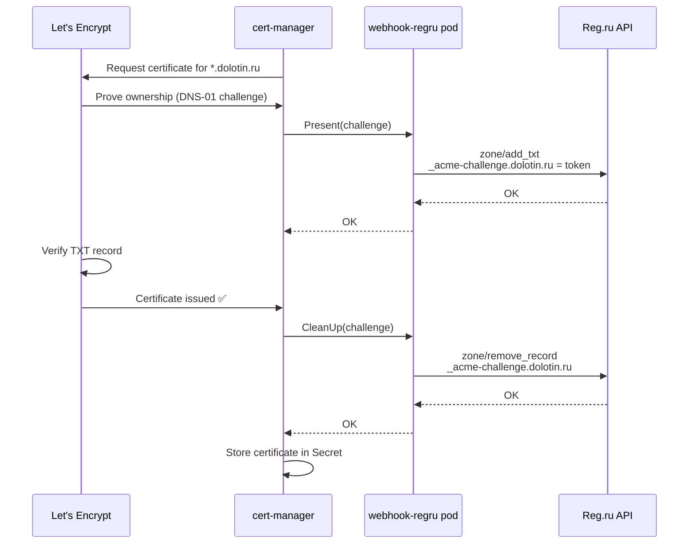

# cert-manager-webhook-regru

Cert-manager ACME DNS-01 webhook solver for [Reg.ru](https://www.reg.ru/) DNS.

Enables wildcard TLS certificates (e.g. `*.dolotin.ru`) via Let's Encrypt
using Reg.ru DNS for domain validation.

## How it works



## Prerequisites

- Kubernetes cluster with cert-manager installed
- Reg.ru account with API access (username + password)

## Installation

```bash
helm upgrade --install cert-manager-webhook-regru \
    ./charts/cert-manager-webhook-regru \
    --namespace cert-manager \
    --set regru.username=YOUR_USERNAME \
    --set regru.password=YOUR_PASSWORD
```

## ClusterIssuer configuration

```yaml
apiVersion: cert-manager.io/v1
kind: ClusterIssuer
metadata:
  name: letsencrypt-prod
spec:
  acme:
    server: https://acme-v02.api.letsencrypt.org/directory
    email: you@example.com
    privateKeySecretRef:
      name: letsencrypt-prod-key
    solvers:
    - dns01:
        webhook:
          groupName: acme.dolotin.ru
          solverName: regru
```

## Architecture

This is a standalone project. It implements two Reg.ru API v2 calls directly:

- `zone/add_txt` — create TXT record (Present)
- `zone/remove_record` — delete TXT record (CleanUp)

Authentication: username + password (standard Reg.ru client API access).

No code is shared with `external-dns-regru-webhook` at the Go level.
Both projects talk to the same Reg.ru API v2 independently.

## Development

```bash
make build      # build binary
make test       # run unit tests
make test-race  # run tests with race detector
make lint       # golangci-lint
```

## Docker

```bash
make docker-build
make docker-push
```
